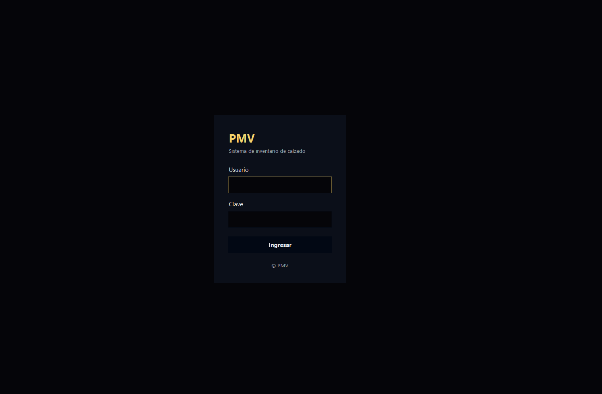
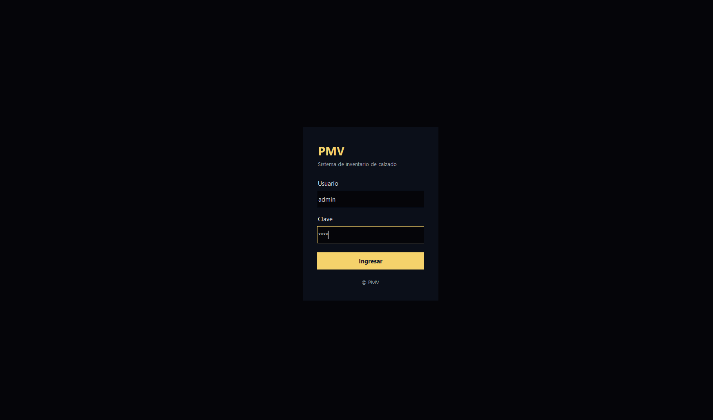
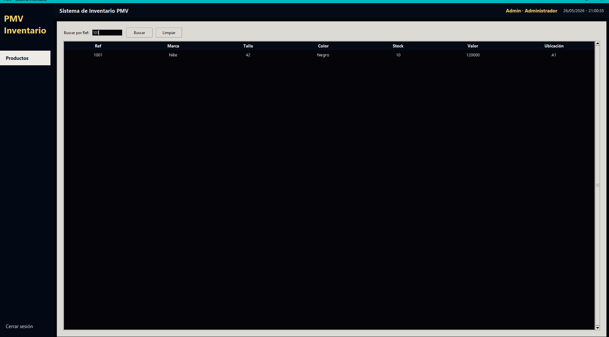

# SistemaPMV

SistemaPMV es una aplicación de gestión de inventario orientada a pequeños y medianos almacenes de calzado. El sistema busca ofrecer una solución accesible para negocios que no cuentan con el presupuesto necesario para implementar plataformas empresariales costosas o servicios en la nube.

La aplicación permite administrar productos, empleados y futuras funcionalidades relacionadas con ventas, autenticación y control de inventario, utilizando tecnologías locales y de fácil implementación.

El proyecto está siendo desarrollado como parte del proceso formativo ADSO del SENA, aplicando buenas prácticas de organización de código, control de versiones con Git y trabajo colaborativo mediante GitHub.

---

# Objetivo del proyecto

Desarrollar un sistema modular, económico y fácil de implementar que permita:

- Gestionar productos de almacenes de calzado
- Administrar empleados
- Implementar autenticación de usuarios
- Organizar inventario de manera local y eficiente
- Escalar futuras funcionalidades como facturación y reportes

---

# Tecnologías utilizadas

| Tecnología | Uso |
|---|---|
| Python | Lógica principal del sistema |
| MongoDB | Base de datos NoSQL |
| PyMongo | Conexión entre Python y MongoDB |
| Tkinter | Interfaz gráfica |
| Git | Control de versiones |
| GitHub | Trabajo colaborativo y repositorio remoto |
| Visual Studio Code | Entorno de desarrollo |

---

# Arquitectura del sistema

El proyecto utiliza una arquitectura modular organizada por capas para facilitar el mantenimiento, la escalabilidad y la implementación local en pequeños negocios que requieren soluciones tecnológicas accesibles.

## Componentes principales

### UI
Contiene la interfaz gráfica y las ventanas del sistema.

### Services
Implementa la lógica de negocio y comunicación entre la interfaz y la base de datos.

### Models
Representa las entidades principales del sistema, como productos y empleados.

### Database
Gestiona la conexión centralizada con MongoDB mediante PyMongo.

---

# Estructura del proyecto

```text
SistemaPMV/
│
├── database/
│   └── conexion.py
│
├── models/
│   ├── producto.py
│   └── empleado.py
│
├── services/
│   ├── producto_service.py
│   └── empleado_service.py
│
├── ui/
│
├── docs/
│
├── app.py
│
└── README.md
```

---

# Funcionalidades implementadas

- Conexión funcional a MongoDB
- Gestión de productos
- Gestión de empleados
- Arquitectura modular
- Interfaz inicial de login
- Botón de cerrar sesión
- Persistencia de datos en MongoDB
- Trabajo colaborativo mediante Git y GitHub

---

# Acceso al sistema

Para ingresar al sistema utilice las siguientes credenciales iniciales:

| Rol | Usuario | Contraseña |
|---|---|---|
| Administrador | admin | 1234 |

---

# Instalación del proyecto

## 1. Clonar el repositorio

```bash
git clone https://github.com/fperdomo161dev-design/SistemaPMV.git
```

---

## 2. Entrar al proyecto

```bash
cd SistemaPMV
```

---

## 3. Instalar dependencias

```bash
pip install pymongo
```

---

# Configuración de MongoDB

## Instalación de MongoDB

### 1. Descargar MongoDB Community Server

Descargar MongoDB desde el sitio oficial:

https://www.mongodb.com/try/download/community

---

### 2. Instalar MongoDB

Durante la instalación se recomienda:

- Seleccionar instalación `Complete`
- Instalar MongoDB Compass
- Mantener MongoDB como servicio de Windows

---

### 3. Verificar instalación

Abrir PowerShell o CMD y ejecutar:

```bash
mongosh
```

Si MongoDB está funcionando correctamente, se abrirá la consola interactiva.

---

# Instalación de MongoDB Database Tools

El proyecto utiliza MongoDB Database Tools para exportar e importar la base de datos.

Carpeta utilizada:

```text
mongodb-database-tools-windows-x86_64-100.14.0
```

Las herramientas pueden descargarse desde:

https://www.mongodb.com/try/download/database-tools

---

# Base de datos utilizada

Nombre de la base de datos:

```text
zapateria_pmv
```

Cadena de conexión utilizada:

```python
MongoClient("mongodb://localhost:27017/")
```

---

# Restaurar base de datos

El proyecto incluye un archivo `.rar` que contiene:

- Backup de la base de datos `zapateria_pmv`
- Carpeta `mongodb-database-tools-windows-x86_64-100.14.0`

## 1. Descomprimir el archivo RAR

Extraer el contenido del archivo en cualquier ubicación del computador.

---

## 2. Abrir terminal dentro de MongoDB Database Tools

Ubicarse dentro de la carpeta `bin`:

```bash
cd mongodb-database-tools-windows-x86_64-100.14.0\bin
```

---

## 3. Restaurar la base de datos

Ejecutar:

```bash
mongorestore --db zapateria_pmv "ruta\\zapateria_pmv"
```

Ejemplo:

```bash
mongorestore --db zapateria_pmv "C:\\Users\\User\\Desktop\\zapateria_pmv"
```

---

## 4. Verificar restauración

Abrir Mongo Shell:

```bash
mongosh
```

Luego ejecutar:

```javascript
show dbs
use zapateria_pmv
show collections
```

---

# Ejecución del proyecto

⚠ Antes de ejecutar el sistema asegúrese de que MongoDB esté iniciado.

Para ejecutar la aplicación:

```bash
python app.py
```

---

# Flujo de trabajo con Git

## Actualizar proyecto

```bash
git pull origin main
```

---

## Guardar cambios

```bash
git add .
git commit -m "descripcion del cambio"
```

---

## Subir cambios

```bash
git push origin main
```

---

# Evidencia funcional

El proyecto cuenta actualmente con:

- Conexión funcional a MongoDB
- Interfaz inicial de login
- Gestión de productos y empleados
- Persistencia de datos
- Botón de cerrar sesión

## Capturas del sistema

---

## Login principal


---

## Validación de acceso



---


## Pantalla de inicio del sistema




---

# Recursos adicionales

El proyecto incluye:

- Backup de la base de datos
- MongoDB Database Tools
- Video explicativo de instalación y funcionamiento
- Evidencias visuales del sistema

---

# Integrantes

- Fredy Perdomo
- Yovanna Rodríguez

---

# Estado del proyecto

Proyecto en desarrollo.

Próximas mejoras:

- Sistema de login completo
- Gestión avanzada de inventario
- Facturación
- Reportes
- Validaciones de usuarios
- Mejoras de interfaz gráfica