# SistemaPMV

SistemaPMV es una aplicación de gestión de inventario y punto de venta orientada a pequeños y medianos almacenes de calzado. El sistema busca ofrecer una solución accesible para negocios que no cuentan con el presupuesto necesario para implementar plataformas empresariales costosas o servicios en la nube.

La aplicación permite administrar productos, empleados, clientes, proveedores, ventas, contabilidad y control de inventario. Además, incorpora autenticación de usuarios mediante librerías de seguridad y cifrado (`hashlib` y `bcrypt`), generación de facturas PDF, envío de correos y herramientas administrativas para la gestión operativa del negocio utilizando tecnologías locales y de fácil implementación.

El proyecto está siendo desarrollado como parte del proceso formativo **ADSO del SENA**, aplicando buenas prácticas de organización de código, control de versiones con Git y trabajo colaborativo mediante GitHub.

Actualmente el sistema opera de manera local utilizando **Python, Tkinter y MongoDB**, permitiendo una implementación sencilla sin requerir servicios externos o infraestructura en la nube.

---

# Objetivo del proyecto

Desarrollar un sistema modular, económico y fácil de implementar que permita:

* Gestionar productos de almacenes de calzado.
* Administrar empleados y usuarios del sistema.
* Garantizar el acceso mediante autenticación segura de usuarios.
* Organizar inventario de manera local y eficiente.
* Gestionar clientes, ventas y facturación.
* Facilitar la administración operativa mediante módulos de proveedores, nómina, contabilidad y servicios públicos.
* Escalar futuras funcionalidades como reportes, estadísticas y herramientas administrativas avanzadas.

---

# Stack tecnológico y Seguridad

| Tecnología / Librería          | Justificación                                                                        |
| :----------------------------- | :----------------------------------------------------------------------------------- |
| **Python**                     | Permite desarrollar aplicaciones rápidas, modulares y fáciles de mantener.           |
| **Tkinter**                    | Facilita la creación de interfaces gráficas locales sin depender de tecnologías web. |
| **MongoDB**                    | Base de datos NoSQL flexible y ligera para gestionar inventario y usuarios.          |
| **PyMongo**                    | Permite integrar Python con MongoDB de manera sencilla.                              |
| **Pillow (PIL)**               | Permite cargar, procesar y visualizar imágenes dentro de la interfaz gráfica.        |
| **ReportLab**                  | Permite generar documentos PDF para la facturación del sistema.                      |
| **hashlib** (`import hashlib`) | Utilizado para el manejo de hashes, como SHA-256, en la validación de claves.        |
| **bcrypt** (`import bcrypt`)   | Librería empleada para el hash seguro de contraseñas de usuarios en el sistema.      |
| **Git & GitHub**               | Control de versiones y trabajo colaborativo en equipo.                               |

---

# Características principales

* Interfaz gráfica moderna desarrollada con Tkinter.
* Base de datos NoSQL en MongoDB.
* Gestión completa de productos (CRUD).
* Gestión completa de empleados (CRUD) con parámetros de nómina.
* Gestión de clientes.
* Gestión de proveedores, facturas y abonos (Cuentas por pagar).
* Módulo de contabilidad y liquidación de nómina.
* Sistema de autenticación seguro con `hashlib` y `bcrypt`.
* Punto de Venta (POS) con carrito de compras integrado.
* Generación automática de facturas en formato PDF y recuperación histórica.
* Control automático de inventario y stock.
* Descuento de inventario al realizar ventas y reposición al anular operaciones.
* Cierre de caja diario.
* Dashboard financiero y analítico.
* Configuración general del sistema.
* Configuración de credenciales de correo SMTP.
* Arquitectura modular por capas.
* Persistencia local de datos.

---

# Descripción de componentes

El sistema se encuentra organizado mediante una arquitectura modular por capas.

## UI

Gestiona la interfaz gráfica del sistema, formularios, ventanas, eventos de usuario y módulos operativos como:

* Productos.
* Empleados.
* Clientes.
* Punto de Venta (POS).
* Contabilidad.
* Dashboard.
* Egresos.
* Ingresos.
* Movimientos.
* Nóminas.
* Proveedores.
* Servicios públicos.
* Configuración.

## Services

Contiene la lógica de negocio del sistema, validaciones de seguridad (`security_service.py`), generación de facturas PDF, envío de correos (`email_service.py`), procesos de ventas, control de caja, contabilidad y comunicación con la base de datos.

## Models

Representa las entidades principales del sistema y las estructuras de datos utilizadas por los diferentes módulos de negocio.

## Database

Centraliza la conexión con MongoDB mediante PyMongo.

---

# Estructura del proyecto

```text
SistemaPMV/
│
├── .vscode/
│   └── settings.json
│
├── Assets/
│
├── database/
│   ├── conexion.py
│   └── __pycache__/
│
├── docs/
│   ├── colaborativo1.png
│   ├── colaborativo2.png
│   ├── configuracion.png
│   ├── dash.png
│   ├── egresos .png
│   ├── ingresos.png
│   ├── inicio_sistema .png
│   ├── login.png
│   ├── modulo_clientes.png
│   ├── modulo_contabilidad.png
│   ├── modulo_empleados .png
│   ├── modulo_pos.png
│   ├── modulo_productos .png
│   ├── moviminetos.png
│   ├── nomina.png
│   ├── proveedores.png
│   └── servicios.png
│
├── facturas/
│   ├── .gitkeep
│   └── FAC-000018.pdf
│
├── models/
│   ├── cliente.py
│   ├── empleado.py
│   ├── factura.py
│   ├── ingreso.py
│   ├── nomina.py
│   ├── producto.py
│   ├── proveedor.py
│   ├── servicio_publico.py
│   └── __pycache__/
│
├── services/
│   ├── cierre_caja_service.py
│   ├── cliente_service.py
│   ├── contabilidad_service.py
│   ├── email_service.py
│   ├── empleado_service.py
│   ├── factura_pdf_service.py
│   ├── ingreso_service.py
│   ├── pos_service.py
│   ├── producto_service.py
│   ├── proveedor_service.py
│   ├── security_service.py
│   ├── servicio_publico_service.py
│   └── __pycache__/
│
├── ui/
│   │
│   ├── contabilidad/
│   │   ├── ui_contabilidad.py
│   │   ├── ui_dashboard.py
│   │   ├── ui_egresos.py
│   │   ├── ui_ingresos.py
│   │   ├── ui_movimientos.py
│   │   ├── ui_nominas.py
│   │   ├── ui_proveedores.py
│   │   ├── ui_servicios.py
│   │   ├── __init__.py
│   │   └── __pycache__/
│   │
│   ├── pos/
│   │   ├── factura_modal.py
│   │   ├── panel_carrito.py
│   │   ├── panel_productos.py
│   │   ├── pos_frame.py
│   │   ├── __init__.py
│   │   └── __pycache__/
│   │
│   ├── login_window.py
│   ├── main_window.py
│   ├── ui_clientes.py
│   ├── ui_configuracion.py
│   ├── ui_empleados.py
│   ├── ui_productos.py
│   └── __pycache__/
│
├── .gitignore
├── app.py
└── README.md
```

---

# Configuración y Restauración de la Base de Datos

Antes de ejecutar SistemaPMV es necesario instalar MongoDB y restaurar la base de datos incluida en el proyecto.

## 1. Descargar MongoDB Community Server

Descargue **MongoDB Community Server** desde el sitio oficial:

https://www.mongodb.com/try/download/community

Seleccione la versión estable más reciente para Windows en formato MSI.

## 2. Instalar MongoDB

Durante la instalación se recomienda:

* Seleccionar la opción **Complete**.
* Instalar **MongoDB Compass**.
* Mantener MongoDB como servicio de Windows.

Reinicie el equipo si el instalador lo solicita.

## 3. Verificar la instalación

Abra PowerShell o CMD y ejecute:

```bash
mongosh
```

## 4. Descargar MongoDB Database Tools

Descargue las herramientas de base de datos desde:

https://www.mongodb.com/try/download/database-tools

La carpeta utilizada para este proyecto es:

```text
mongodb-database-tools-windows-x86_64-100.14.0
```

## 5. Restaurar la base de datos `zapateria_pmv`

Ubíquese en la carpeta `bin` de las herramientas y ejecute:

```bash
mongorestore --db zapateria_pmv "ruta\del\respaldo\zapateria_pmv"
```

Verifique la restauración ejecutando:

```bash
mongosh
```

Luego:

```javascript
use zapateria_pmv
show collections
```

Las colecciones disponibles son:

* `clientes`
* `empleados`
* `facturas`
* `productos`
* `cierres_caja`
* `config_sistema`
* `contabilidad`
* `cuentas_por_pagar`
* `nominas`
* `proveedores`

---

# Configuración del correo electrónico

Si el sistema requiere enviar notificaciones, reportes o facturas por correo electrónico mediante `email_service.py`, es necesario configurar una **Contraseña de Aplicación de Google (App Password)**.

## Paso 1: Activar la Verificación en 2 Pasos

1. Acceda a su cuenta de Google.
2. Diríjase a **Gestión de tu Cuenta de Google**.
3. Seleccione **Seguridad**.
4. Busque el apartado **Cómo inicias sesión en Google**.
5. Active la **Verificación en 2 pasos** siguiendo las instrucciones.

## Paso 2: Generar la Contraseña de Aplicación

1. Regrese a la sección **Seguridad**.
2. Busque **Contraseñas de aplicaciones**.
3. Google puede solicitar nuevamente la autenticación.
4. En **Seleccionar aplicación**, seleccione **Otra (nombre personalizado)**.
5. Introduzca:

```text
SistemaPMV Inventario
```

6. Seleccione **Generar**.

## Paso 3: Configurar la contraseña

Google mostrará una contraseña de aplicación de 16 caracteres.

Copie la contraseña **sin espacios** y guárdela de forma segura.

> **Importante:** Google no volverá a mostrar esta contraseña después de cerrar la ventana.

Introduzca esta contraseña de aplicación junto con el correo electrónico emisor desde el módulo de **Configuración General** del sistema.

---

# Instalación del proyecto

## 1. Clonar el repositorio

```bash
git clone https://github.com/fperdomo161dev-design/SistemaPMV.git
```

## 2. Entrar al directorio del proyecto

```bash
cd SistemaPMV
```

## 3. Instalar dependencias

Ejecute:

```bash
pip install pymongo pillow reportlab bcrypt
```

> **Nota:** `hashlib` viene incluido de forma nativa en Python, por lo que no es necesario instalarlo mediante `pip`.

---

# Acceso al sistema

Credenciales iniciales de prueba almacenadas en la base de datos:

| Rol               | Usuario | Contraseña |
| :---------------- | :------ | :--------- |
| **Administrador** | `admin` | `1234`     |

> **Nota:** Estas credenciales son únicamente para pruebas y demostración del proyecto.

---

# Ejecución del proyecto

Asegúrese de que el servicio de MongoDB esté activo en su equipo.

Luego, desde la carpeta principal del proyecto, ejecute:

```bash
python app.py
```

La aplicación abrirá la ventana de inicio de sesión.

---

# Capturas y Evidencia Funcional del Sistema

## Pantalla de Inicio de Sesión

Vista inicial para autenticar las credenciales del usuario.


---

## Pantalla de Bienvenida / Inicio del Sistema

Vista principal que se muestra después de iniciar sesión correctamente.


---

## Punto de Venta (POS)

Módulo operativo para la selección de productos, administración del carrito y emisión de comprobantes.

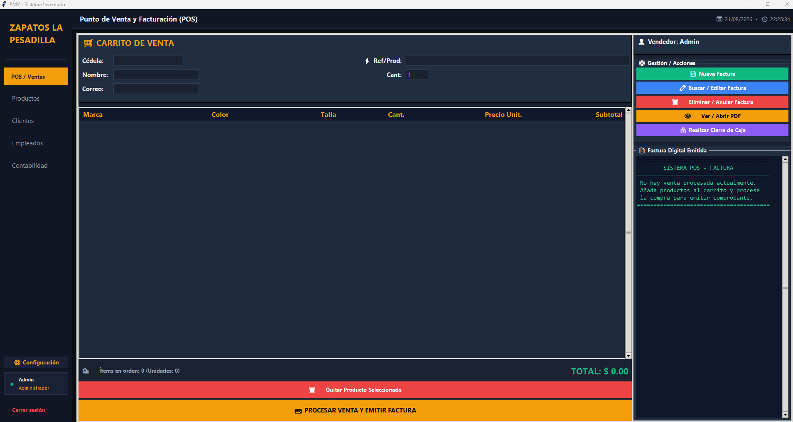

---

## Gestión de Productos e Inventario

Permite administrar el catálogo de calzado y controlar las existencias disponibles.


---

## Gestión de Clientes

Permite registrar y administrar la información de los compradores.

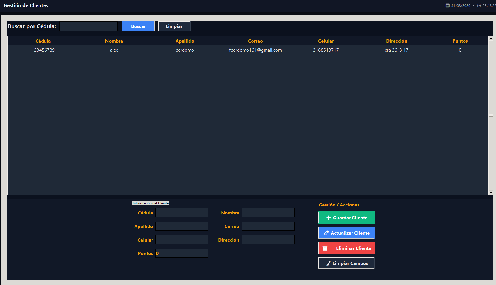

---

## Administración de Personal (Empleados)

Permite gestionar los datos, cargos y parámetros del personal del negocio.


---

## Módulo de Contabilidad General

Panel principal con acceso a los diferentes submódulos financieros.

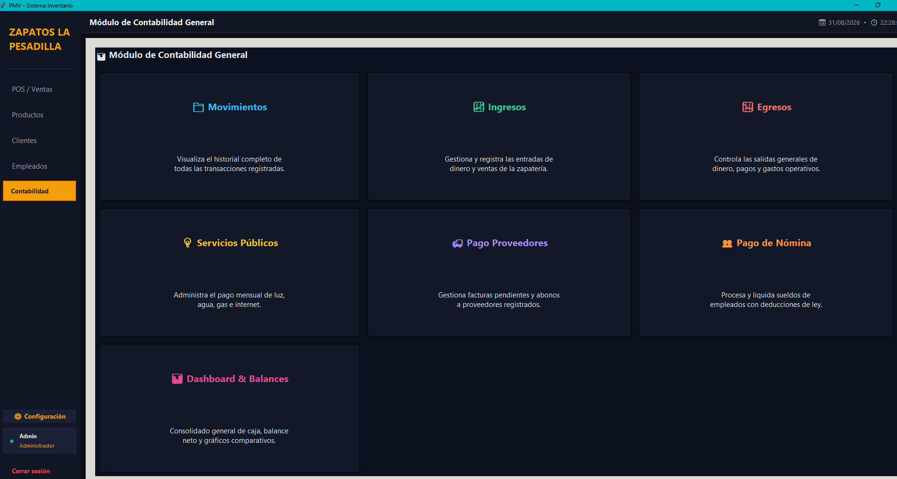

---

## Dashboard Financiero y Analítico

Permite visualizar ingresos, egresos, balances y estadísticas relacionadas con las ventas.

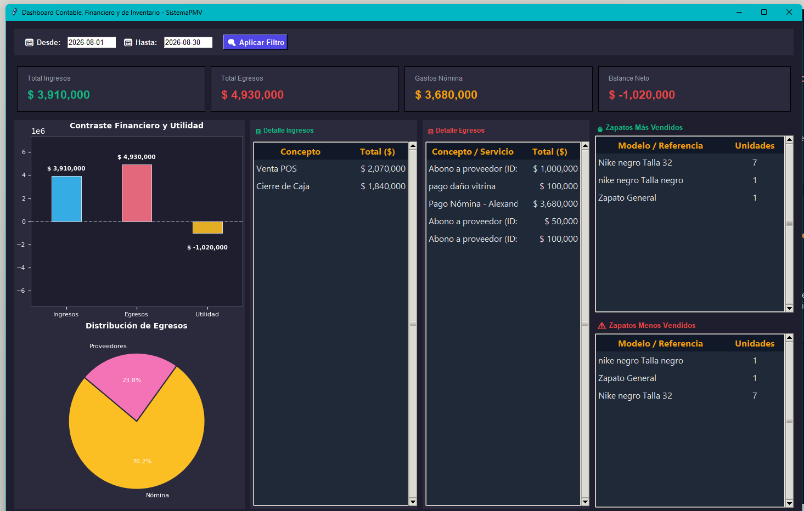

---

## Historial Unificado de Movimientos

Registro cronológico de las diferentes transacciones financieras y operativas realizadas en el sistema.

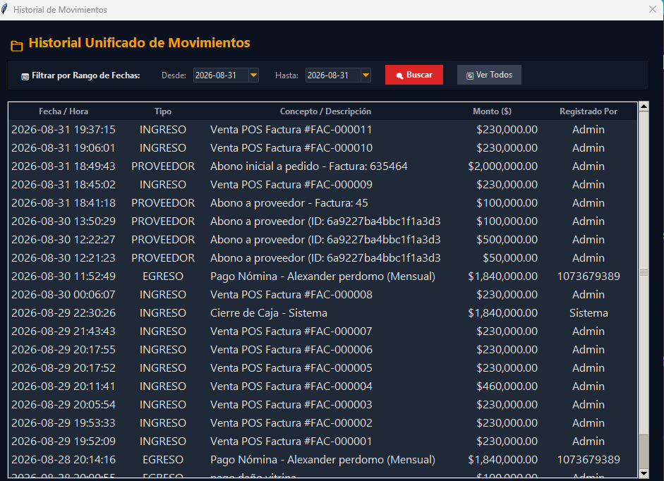

---

## Control de Ingresos

Permite filtrar y visualizar las entradas de dinero y los cierres de caja.

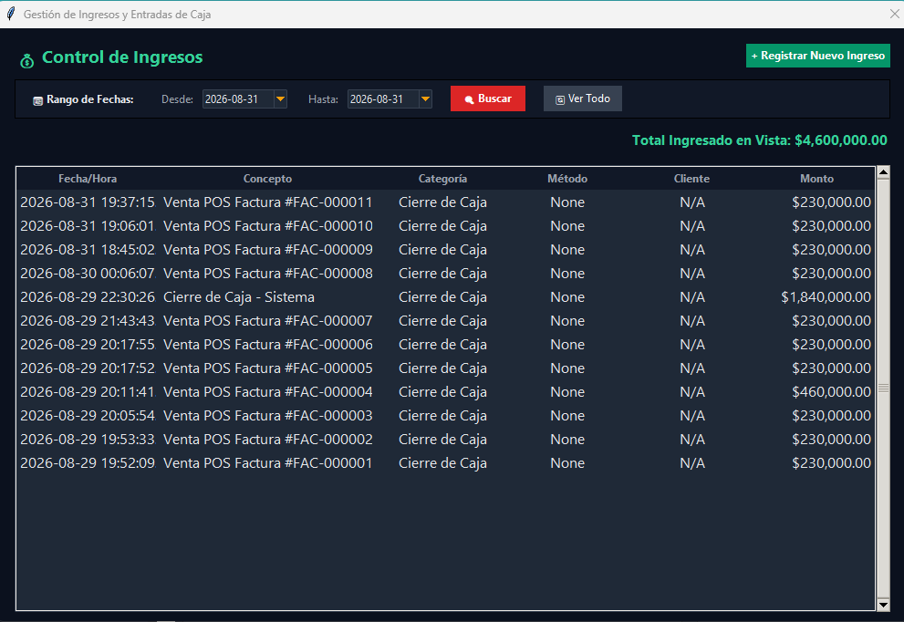

---

## Gestión de Egresos y Gastos Operativos

Permite controlar las salidas de dinero, pagos y abonos realizados por el negocio.


---

## Gestión de Servicios Públicos

Permite registrar y consultar los pagos relacionados con los servicios públicos del establecimiento.

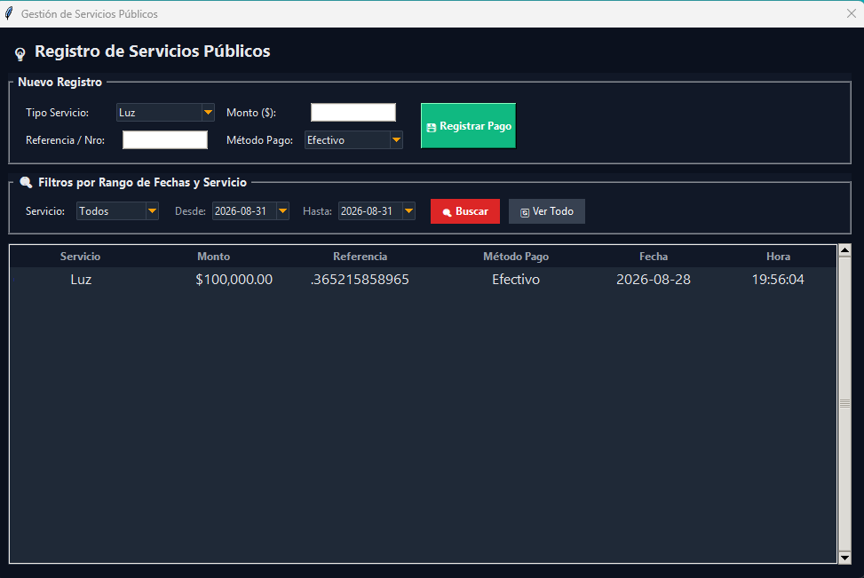

---

## Panel de Facturas y Proveedores

Permite realizar seguimiento a pedidos, facturas de proveedores y abonos pendientes.

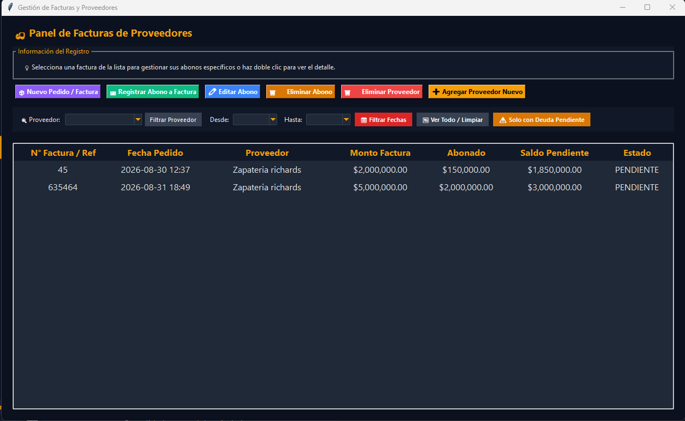

---

## Liquidación y Pago de Nómina

Permite gestionar los pagos salariales periódicos y los pagos correspondientes a días trabajados.

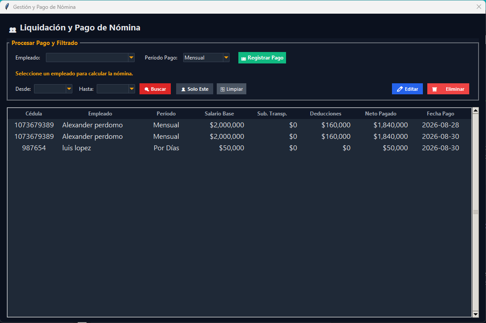

---

## Configuración General del Sistema

Módulo utilizado para configurar los datos del negocio, factura PDF, clave de administrador y credenciales SMTP.

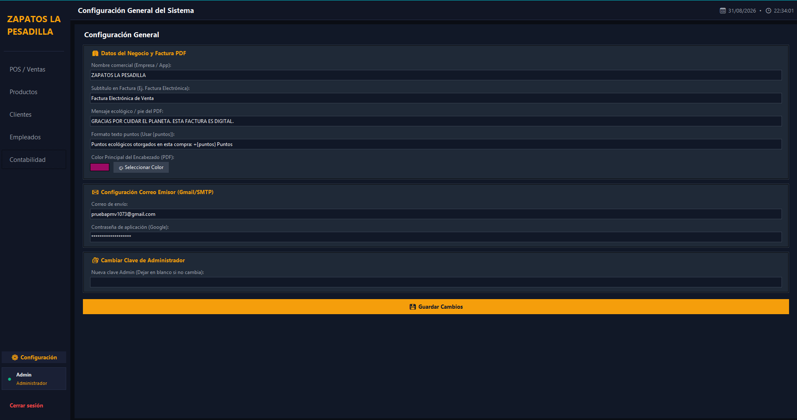

---

# Trabajo colaborativo — Git & GitHub

El proyecto fue desarrollado mediante trabajo colaborativo utilizando **Git y GitHub**, permitiendo llevar un registro de los cambios realizados por cada integrante del equipo.

## Historial de Commits de Yovanna Rodríguez

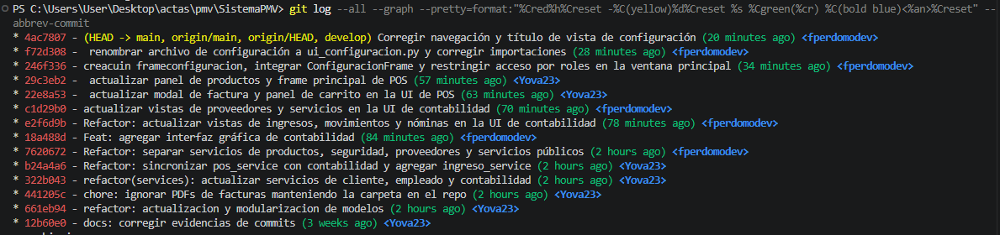

## Historial de Commits de Fredy Perdomo

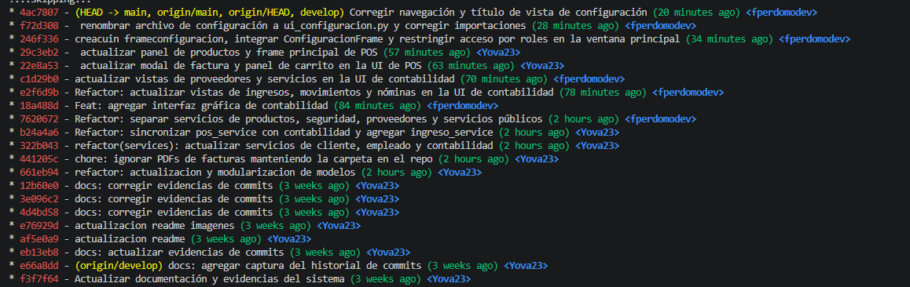

---

# Integrantes

* **Fredy Perdomo**
* **Yovanna Rodríguez**

---

# Proyecto formativo

**ADSO — SENA**

**2026**
