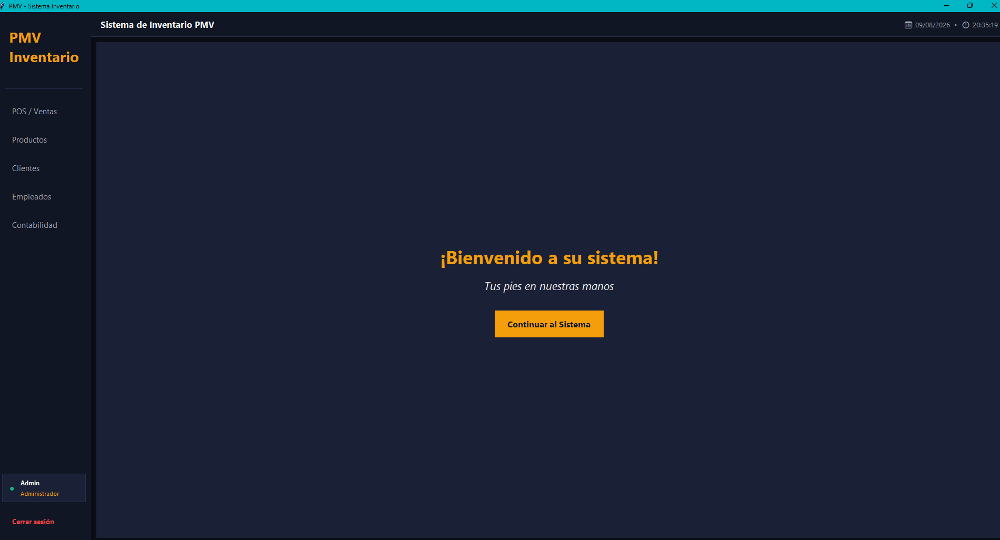
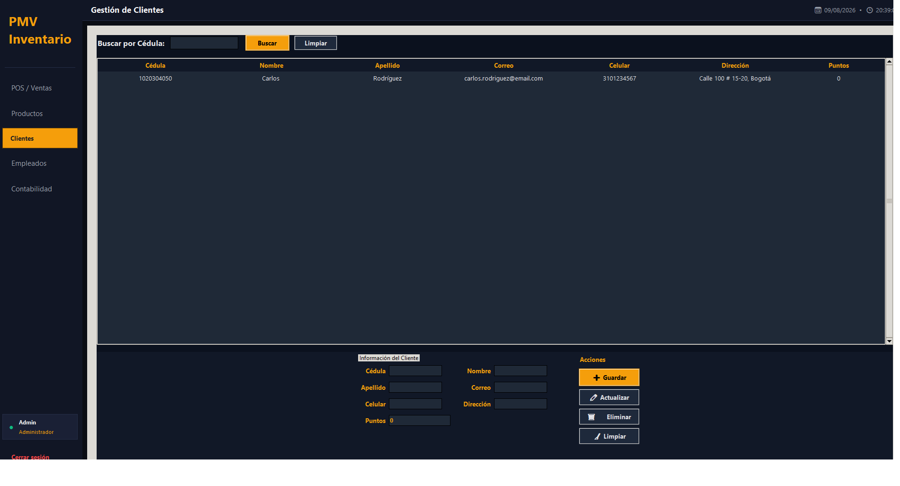
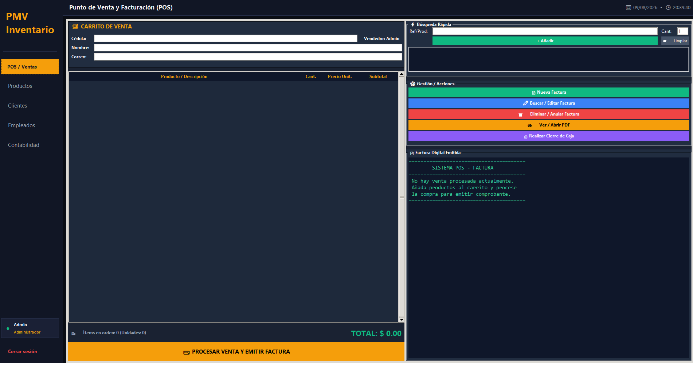
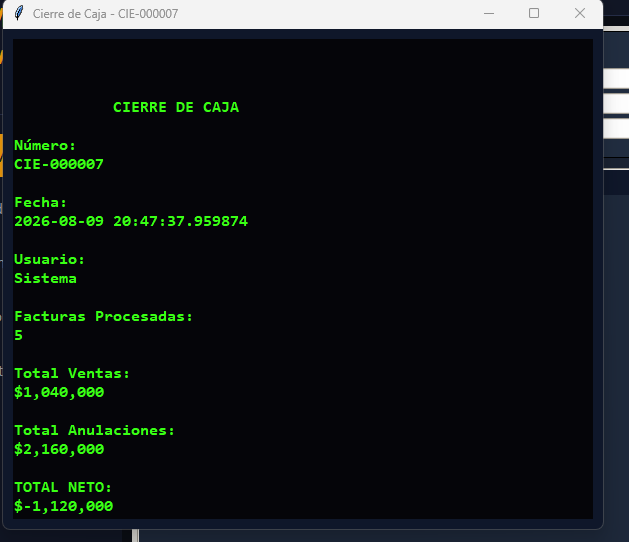
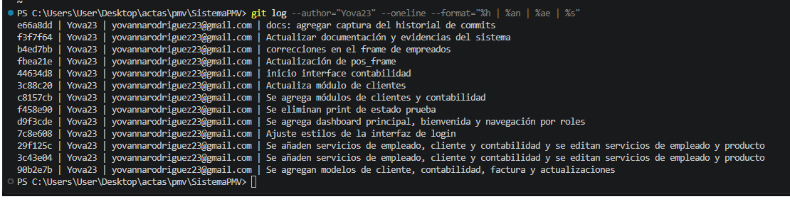
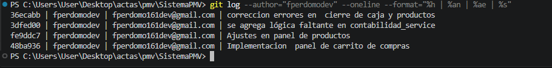

# SistemaPMV

SistemaPMV es una aplicación de gestión de inventario orientada a pequeños y medianos almacenes de calzado. El sistema busca ofrecer una solución accesible para negocios que no cuentan con el presupuesto necesario para implementar plataformas empresariales costosas o servicios en la nube.

La aplicación permite administrar productos, empleados, clientes, proveedores, ventas e inventario. Además, incorpora autenticación de usuarios, generación de facturas PDF y herramientas administrativas para la gestión operativa del negocio, utilizando tecnologías locales y de fácil implementación.

El proyecto está siendo desarrollado como parte del proceso formativo ADSO del SENA, aplicando buenas prácticas de organización de código, control de versiones con Git y trabajo colaborativo mediante GitHub.

Actualmente el sistema opera de manera local utilizando Python, Tkinter y MongoDB, permitiendo una implementación sencilla sin requerir servicios externos o infraestructura en la nube.

---

# Objetivo del proyecto

Desarrollar un sistema modular, económico y fácil de implementar que permita:

- Gestionar productos de almacenes de calzado.
- Administrar empleados y usuarios del sistema.
- Garantizar el acceso mediante autenticación de usuarios.
- Organizar inventario de manera local y eficiente.
- Gestionar clientes, ventas y facturación.
- Facilitar la administración operativa mediante módulos de proveedores, nómina y cuentas por pagar.
- Escalar futuras funcionalidades como reportes, estadísticas y herramientas administrativas avanzadas.

---
# Stack tecnológico

| Tecnología         | Justificación                                                                        |
| ------------------ | ------------------------------------------------------------------------------------ |
| Python             | Permite desarrollar aplicaciones rápidas, modulares y fáciles de mantener.           |
| Tkinter            | Facilita la creación de interfaces gráficas locales sin depender de tecnologías web. |
| MongoDB            | Base de datos NoSQL flexible y ligera para gestionar inventario y usuarios.          |
| PyMongo            | Permite integrar Python con MongoDB de manera sencilla.                              |
| Pillow (PIL)       | Permite cargar, procesar y visualizar imágenes dentro de la interfaz gráfica.        |
| ReportLab          | Permite generar documentos PDF para la facturación del sistema.                      |
| Git                | Control de versiones para seguimiento del desarrollo.                                |
| GitHub             | Trabajo colaborativo y respaldo del proyecto.                                        |
| Visual Studio Code | Entorno de desarrollo utilizado por el equipo.                                       |

---

# Características principales

- Interfaz gráfica desarrollada con Tkinter.
- Base de datos MongoDB.
- Gestión completa de productos (CRUD).
- Gestión completa de empleados (CRUD).
- Gestión de clientes.
- Gestión de proveedores.
- Sistema de autenticación de usuarios.
- Punto de venta (POS).
- Generación automática de facturas PDF.
- Recuperación de facturas desde MongoDB.
- Control automático de inventario y stock.
- Gestión de nómina.
- Gestión de cuentas por pagar.
- Cierre de caja.
- Arquitectura modular por capas.
- Persistencia local de datos.
- Control de versiones mediante Git y GitHub.

---
# Descripción de componentes

El sistema se encuentra organizado mediante una arquitectura modular por capas:

## UI

Gestiona la interfaz gráfica del sistema, formularios, ventanas, eventos de usuario y módulos operativos como productos, empleados, clientes y punto de venta (POS).

## Services

Contiene la lógica de negocio del sistema, validaciones de seguridad, generación de facturas PDF, procesos de ventas, cierre de caja y comunicación con la base de datos.

## Models

Representa las entidades principales del sistema y las estructuras de datos utilizadas por los diferentes módulos de negocio.

## Database

Centraliza la conexión con MongoDB mediante PyMongo.

---

Usuario
    │
    ▼
Inicio de sesión
    │
    ▼
Panel principal
    │
    ├── POS / Ventas
    ├── Productos
    ├── Clientes
    ├── Empleados
    └── Contabilidad (en desarrollo)
            │
            ▼
        Services
            │
            ▼
         MongoDB

# Estructura del proyecto

```text
SistemaPMV/
│
├── Assets/
│
├── database/
│   └── conexion.py
│
├── docs/
│
├── facturas/
│
├── models/
│
├── services/
│   ├── cierre_caja_service.py
│   ├── cliente_service.py
│   ├── contabilidad_service.py
│   ├── empleado_service.py
│   ├── factura_pdf_service.py
│   ├── pos_service.py
│   ├── producto_service.py
│   └── security_service.py
│
├── ui/
│   ├── pos/
│   │   ├── __init__.py
│   │   ├── factura_modal.py
│   │   ├── panel_carrito.py
│   │   ├── panel_productos.py
│   │   └── pos_frame.py
│   │
│   ├── login_window.py
│   ├── main_window.py
│   ├── ui_clientes.py
│   ├── ui_contabilidad.py
│   ├── ui_empleados.py
│   └── ui_productos.py
│
├── .gitignore
├── app.py
└── README.md
```

---

# Funcionalidades implementadas

- Sistema de autenticación de usuarios.
- Protección de contraseñas mediante hash SHA-256.
- CRUD completo de productos.
- CRUD completo de empleados.
- CRUD completo de clientes.
- Punto de Venta (POS).
- Generación de facturas en formato PDF.
- Apertura y recuperación de facturas históricas.
- Gestión de ventas y carrito de compras.
- Actualización automática de inventario al realizar ventas.
- Restauración de stock al anular facturas.
- Cierre de caja.
- Persistencia de datos mediante MongoDB.
- Arquitectura modular por capas.
- Interfaz gráfica desarrollada con Tkinter.
- Control de versiones mediante Git y GitHub.

---
# Funcionalidades en desarrollo

- Módulo de contabilidad.
- Reportes financieros.
- Gestión avanzada de proveedores.

---

# Acceso al sistema

Para ingresar al sistema utilice las siguientes credenciales iniciales incluidas en la base de datos de prueba:

| Rol           | Usuario | Contraseña |
| ------------- | ------- | ---------- |
| Administrador | admin   | 1234       |

> Nota: La contraseña se almacena cifrada mediante hash SHA-256 en la base de datos. La credencial mostrada corresponde únicamente al acceso inicial del sistema de pruebas.

---

# Configuración y Restauración de la Base de Datos

Antes de ejecutar SistemaPMV es necesario instalar MongoDB y restaurar la base de datos incluida en el proyecto.

---

## 1. Descargar MongoDB Community Server

Descargue MongoDB Community Server desde el sitio oficial:

https://www.mongodb.com/try/download/community

Seleccione:

- Versión estable más reciente.
- Sistema operativo Windows.
- Instalador MSI.

---

## 2. Instalar MongoDB

Durante la instalación se recomienda:

- Seleccionar la opción **Complete**.
- Instalar **MongoDB Compass**.
- Mantener MongoDB como servicio de Windows.

Una vez finalizada la instalación, reinicie el equipo si el instalador lo solicita.

---

## 3. Verificar la instalación de MongoDB

Abra PowerShell o CMD y ejecute:

```bash
mongosh
```

Si la instalación fue correcta, se abrirá la consola interactiva de MongoDB.

---

## 4. Descargar MongoDB Database Tools

SistemaPMV utiliza MongoDB Database Tools para restaurar el respaldo de la base de datos.

Descarga oficial:

https://www.mongodb.com/try/download/database-tools

Descargue la versión correspondiente a Windows y descomprima el archivo.

La carpeta utilizada para este proyecto es:

```text
mongodb-database-tools-windows-x86_64-100.14.0
```

---

## 5. Base de datos utilizada

Nombre de la base de datos:

```text
zapateria_pmv
```

Cadena de conexión utilizada por el sistema:

```python
MongoClient("mongodb://localhost:27017/")
```

---

## 6. Restaurar la base de datos

El proyecto incluye un archivo comprimido que contiene:

- Backup de la base de datos `zapateria_pmv`
- MongoDB Database Tools

### Paso 1. Descomprimir el archivo

Extraiga el archivo en cualquier ubicación del computador.

Ejemplo:

```text
C:\SistemaPMV\
```

---

### Paso 2. Abrir la terminal en la carpeta bin

Ubíquese dentro de la carpeta:

```bash
cd mongodb-database-tools-windows-x86_64-100.14.0\bin
```

---

### Paso 3. Ejecutar la restauración

Ejecute el siguiente comando:

```bash
mongorestore --db zapateria_pmv "ruta\zapateria_pmv"
```

Ejemplo:

```bash
mongorestore --db zapateria_pmv "C:\Users\User\Desktop\zapateria_pmv"
```

---

### Paso 4. Verificar la restauración

Abra Mongo Shell:

```bash
mongosh
```

Ejecute:

```javascript
show dbs
use zapateria_pmv
show collections
```

Deberán visualizarse las siguientes colecciones:

```text
clientes
empleados
facturas
productos
cierres_caja
config_sistema
contabilidad
cuentas_por_pagar
nominas
proveedores
```

Si las colecciones aparecen correctamente, la restauración fue exitosa.

---

# Instalación del Proyecto

Una vez restaurada la base de datos, proceda con la instalación del proyecto.

## 1. Clonar el repositorio

```bash
git clone https://github.com/fperdomo161dev-design/SistemaPMV.git
```

---

## 2. Entrar al proyecto

```bash
cd SistemaPMV
```

---

## 3. Instalar dependencias

```bash
pip install pymongo pillow reportlab
```

---

# Acceso al Sistema

Credenciales incluidas en la base de datos de prueba:

| Rol | Usuario | Contraseña |
|------|----------|------------|
| Administrador | admin | 1234 |

> La contraseña es almacenada mediante hash SHA-256 dentro de la base de datos.

---

# Ejecución del Proyecto

Antes de ejecutar el sistema asegúrese de que MongoDB esté iniciado.

Ejecutar:

```bash
python app.py
```

Al iniciar sesión podrá acceder a:

- Productos
- Empleados
- Clientes
- POS / Ventas
- Contabilidad (en desarrollo)

---

# Flujo de trabajo con Git

## Actualizar proyecto

```bash
git pull origin main
```

## Guardar cambios

```bash
git add .
git commit -m "descripcion del cambio"
```

## Subir cambios

```bash
git push origin main
```

# Evidencia funcional

El proyecto cuenta actualmente con las siguientes funcionalidades implementadas:

- Sistema de autenticación de usuarios.
- Protección de contraseñas mediante hash SHA-256.
- CRUD completo de productos.
- CRUD completo de empleados.
- CRUD completo de clientes.
- Punto de Venta (POS).
- Gestión de carrito de compras.
- Generación automática de facturas PDF.
- Apertura y recuperación de facturas históricas.
- Actualización automática de inventario y stock.
- Anulación de facturas con restauración de stock.
- Cierre de caja.
- Persistencia de datos utilizando MongoDB.
- Arquitectura modular por capas.
- Interfaz gráfica desarrollada con Tkinter.
- Control de versiones mediante Git y GitHub.

# Capturas del sistema

Las siguientes imágenes evidencian las principales funcionalidades implementadas en SistemaPMV.

---

## Inicio de sesión

El sistema cuenta con un mecanismo de autenticación que valida las credenciales de acceso de los usuarios registrados. Las contraseñas son almacenadas de forma segura mediante hash SHA-256.


---

## Menú principal

Panel principal desde donde se accede a los diferentes módulos del sistema según las funcionalidades disponibles.



---

## Gestión de Productos

Permite administrar el inventario de productos mediante operaciones CRUD.

Funcionalidades:

- Registrar productos.
- Buscar productos por referencia.
- Actualizar información de productos.
- Eliminar productos.
- Consultar inventario en tiempo real.


---

## Gestión de Empleados

Permite administrar la información de los empleados registrados en el sistema.

Funcionalidades:

- Registrar empleados.
- Buscar empleados por cédula.
- Actualizar información.
- Eliminar registros.
- Consultar listado de empleados.


---

## Gestión de Clientes

Permite registrar y consultar la información de los clientes asociados a las ventas realizadas.

Funcionalidades:

- Registrar clientes.
- Consultar clientes existentes.
- Actualizar información.
- Gestionar historial asociado a ventas.


---

## Punto de Venta (POS)

Módulo encargado del proceso de ventas y facturación.

Funcionalidades:

- Selección de productos.
- Gestión de carrito de compras.
- Cálculo automático de totales.
- Generación de ventas.
- Actualización automática de inventario.



---

## Facturación Digital

Generación automática de facturas en formato PDF a partir de las ventas realizadas.

Funcionalidades:

- Generación de factura PDF.
- Apertura de facturas históricas.
- Recuperación automática de facturas almacenadas.
- Consulta por número de factura.


---

## Cierre de Caja

Permite consolidar y registrar los movimientos de caja generados durante la operación diaria.

Funcionalidades:

- Registro de cierre diario.
- Consolidación de ventas.
- Generación de información para control administrativo.



---

## Control de Inventario

El sistema actualiza automáticamente las existencias de productos al realizar ventas o anular facturas.

Funcionalidades:

- Descuento automático de stock.
- Restauración de inventario al anular ventas.
- Consulta de existencias disponibles.


---

## Módulo de Contabilidad (En desarrollo)

Se encuentra implementada la interfaz inicial del módulo, actualmente en proceso de desarrollo de la lógica de negocio y generación de reportes financieros.


---


## Trabajo colaborativo

#### Commits de Yova23


#### Commits de fperdomodev

---

# Recursos adicionales

El proyecto incluye:

- Backup de la base de datos
- MongoDB Database Tools
- Video explicativo de instalación y funcionamiento
- Evidencias visuales del sistema

---

# Integrantes

- Fredy Perdomo
- Yovanna Rodríguez

---


## Estado del proyecto

### Funcionalidades completadas

* Inicio de sesión.
* Gestión completa de productos (CRUD).
* Gestión completa de empleados (CRUD).
* Gestión de clientes.
* Registro y gestión de ventas.
* Generación de facturas en formato PDF.
* Consulta y apertura de facturas.
* Control y actualización automática del inventario.
* Actualización del stock al realizar ventas.
* Restitución del stock al anular facturas.
* Cierre y control de caja.
* Persistencia de datos mediante MongoDB.
* Arquitectura modular.
* Control de versiones mediante Git y GitHub.

### Próximas funcionalidades

* Generación de reportes de ventas e inventario.
* Dashboard con indicadores y estadísticas.
* Mejoras y ampliaciones del sistema de inventario.
